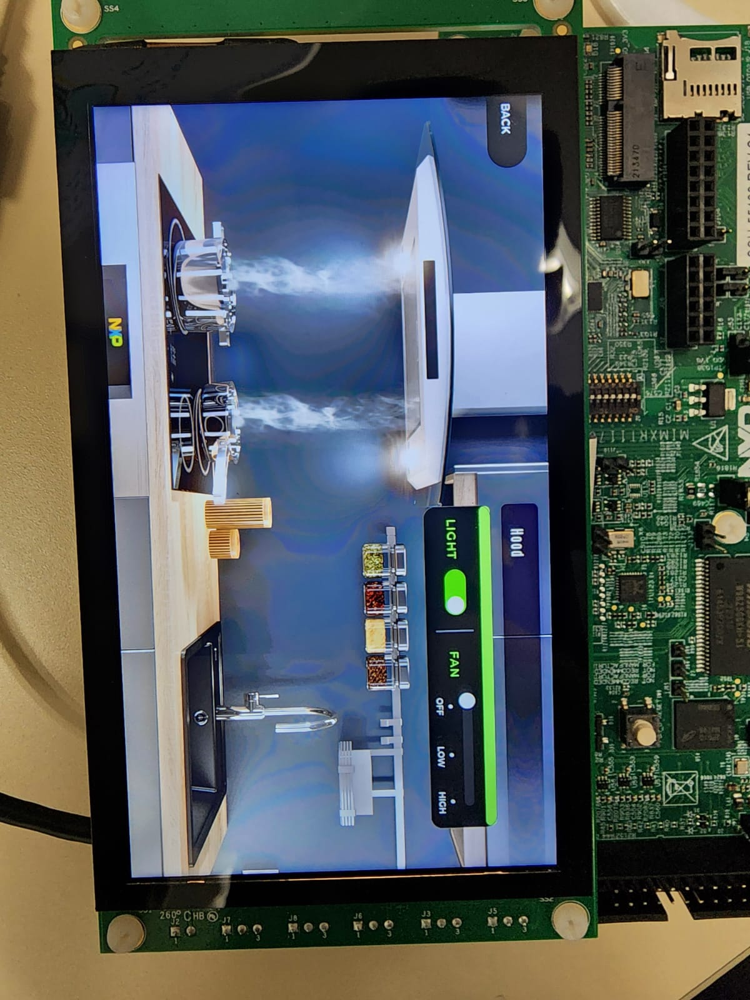

# NXP Application Code Hub

## Full Appliance Demo
This is a Full Appliance Demo with LVGL on MIMXRT1170-EVKB with RK055HDMIPI4M 5.5" LCD panel. This Demo shows three appliances, an Oven, an Aircon and a Hood (each appliance has its own animations and can switch between screens), it also has a central dashboard with the status of all appliances.

#### Boards: MIMXRT1170-EVKB
#### Categories: Graphics
#### Peripherals: DISPLAY
#### Toolchains: MCUXpresso IDE

## Table of Contents
1. [Software](#step1)
2. [Hardware](#step2)
3. [Setup](#step3)
4. [Results](#step4)
5. [FAQs](#step5) 
6. [Support](#step6)
7. [Release Notes](#step7)

## 1. Software
This code has been implemented using [MCUXpresso IDE](https://nxp.com/mcuxpresso) version 11.7.1. [GUI Guider](https://nxp.com/gui-guider) v1.6.0 was used to import the Lottie files and generate the initial design. LVGL (version 8.3.5) and all other software is included in [MCUXpresso SDK](https://mcuxpresso.nxp.com) - version 2.13.1 was used.

## 2. Hardware
- Purchase supported board:
    - [MIMXRT1170-EVKB](https://www.nxp.com/part/MIMXRT1170-EVKB#/)
    
- Purchase supported display: 
    - [RK055HDMIPI4MA0](https://www.nxp.com/part/RK055HDMIPI4MA0#/)

- Power Adapter

## 3. Setup

### 3.1 Step 1
Import the project into MCUXpresso IDE by following the noted sections of the "MCUXpresso IDE - User Guide" found in the documentation section of the [MCUXpresso IDE page](https://www.nxp.com/design/software/development-software/mcuxpresso-software-and-tools-/mcuxpresso-integrated-development-environment-ide:MCUXpresso-IDE):
### 3.2 Step 2
Connect the LCD panel to connector J48 of i.MX RT1170-EVKB board.
### 3.3 Step 3
Open the MCUXpresso project
### 3.4 Step 4
Download the built project (in release mode instead debug mode) to the board and run the example.

## 4. Results

When the demo runs correctly, we will see the following interfaces.

## 5. FAQs

## 6. Support
If you have any questions or feedback on this code please contact NXP support or post on our community at https://community.nxp.com/. You can find forums here for different aspects of this code example, including GUI Guider, MCUXpresso tools and device families.

#### Project Metadata
<!----- Boards ----->

<!----- Categories ----->

<!----- Peripherals ----->

<!----- Toolchains ----->

Questions regarding the content/correctness of this example can be entered as Issues within this GitHub repository.

>**Warning**: For more general technical questions regarding NXP Microcontrollers and the difference in expected funcionality, enter your questions on the [NXP Community Forum](https://community.nxp.com/)

## 7. Release Notes
| Version | Description / Update                           | Date                        |
|:-------:|------------------------------------------------|----------------------------:|
| 1.0     | Initial release on Application Code HUb        |  August 31rd 2023 |

